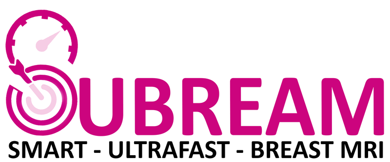

# Mindful-Subream



## Overview

Extension of [`Mindful-core`](https://github.com/heds-trm/mindful_core) for the [*SUBREAM*](https://www.hesge.ch/heds/rad/projets/subream) and [*Lesion Lens*](https://www.hesge.ch/heds/rad/projets/lesionlens) projects. We developped deep learning models to characterize breast lesions in Ultrafast DCE MRI images[^1]. The main contribution of these models is to support multiple types of information encoded as:
- images 
- scalar information
- categorical information

The [examples](./examples/README.md) section depict how the Mindful framework can be applied to classify multimodal data. 

Powered by:
- [](https://pytorch.org/) ([](https://opensource.org/licenses/BSD-3-Clause))
- [](https://github.com/SimpleITK/SimpleITK) ([](https://opensource.org/licenses/Apache-2.0))
- [](https://github.com/project-monai/monai) ([](https://opensource.org/licenses/Apache-2.0))
- [](https://github.com/heds-trm/mindful_core) ([](https://opensource.org/licenses/Apache-2.0))


## Versioning

This project follows [Semantic Versioning 2.0.0](https://semver.org/).

Given a version number MAJOR.MINOR.PATCH:

- MAJOR version for incompatible API changes.
- MINOR version for backward-compatible functionality.
- PATCH version for backward-compatible bug fixes.

To get the current version in your code:
```
import mindful_subream
print(mindful_subream.__version__)
```

> [!NOTE]
> The version is written in `version.py` by maintainers at every release from the `pyproject.toml` file.

## Funding and Ethics

The Smart and Ultrafast Breast MRI (SUBREAM) project was funded by the Swiss Cancer Research (KFS-5460–08-2021-R) and the Lesion Lens project was funded by the Fonds de Recherche et d’Impulsion (FRI) HES-SO (AGP: 133801). Additional funding supported the public release of Mindful code and the publication of Lesion Lens on Grand-Challenge platform (HES-SO R&I - Open Research Data call 138082/RI-STRATEGIE25-03).

The project was approved by the Geneva Cantonal Ethics Committee (CCER) (Project-ID: 2019-00716). Informed consent was obtained from each patient for the re-use of anonymized breast imaging reports and MRI examinations.

## Contributors and roles

Contributor metadata is available in:
- `CITATION.cff` for citation metadata
- `CONTRIBUTORS.md` for detailed roles and contributions


[^1]: Lokaj, B., Durand de Gevigney, V., Djema, D. A., Zaghir, J., Goldman, J. P., Bjelogrlic, M., Turbe, H., Kinkel, K., Lovis, C., Schmid, J. (2025). Multimodal deep learning fusion of ultrafast-DCE MRI and clinical information for breast lesion classification. Computers in biology and medicine. [10.1016/j.compbiomed.2025.109721](https://doi.org/10.1016/j.compbiomed.2025.109721)
