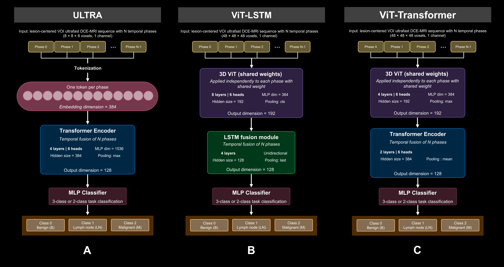

# Introduction

This example will showcase the use of various 4D models to characterize breast lesions in Ultrafast (UF) dynamic contrast enhanced (DCE) MRI based on a publication currently under review.


Three models are compared on the same task, dataset and experiment protocol using the `mindful_subream` framework. Each has its own documentation set (README, experiment, hparams and pipeline configuration) : 



|   | Model | Approach | Input data | Documentation |
|---|-------|----------|------------|---------------|
| **A** | **Ultra** | The whole 4D ultrafast sequence is input as a single tensor into one transformer encoder (phases of `8 x 8 x 8` volume), followed by an MLP classifier. | Full 13-phase sequence and phase-ablation configurations: 7 phases, 4 phases, 3 phases, 2 middle phases (“mid”), and first and last phases only (“first-last”) | [Experiment](./Ultra/Ultra_EXPERIMENT_CONFIGURATION.md) · [HParams](./Ultra/Ultra_HPARAMS_CONFIGURATION.md) · [Pipeline](./Ultra/Ultra_PIPELINE_CONFIGURATION.md) |
| **B**  | **ViT-LSTM** | Each phase (`48 x 48 x 48`) is encoded by a weight shared 3D ViT, the sequence of embeddings is fused by an LSTM, followed by an MLP classifier. | Full 13-phase sequence and phase-ablation configurations: 7 phases, 4 phases, 3 phases, 2 middle phases (“mid”), and first and last phases only (“first-last”) | [Experiment](./ViT-LSTM/ViT-LSTM_EXPERIMENT_CONFIGURATION.md) · [HParams](./ViT-LSTM/ViT-LSTM_HPARAMS_CONFIGURATION.md) · [Pipeline](./ViT-LSTM/ViT-LSTM_PIPELINE_CONFIGURATION.md) |
| **C** | **ViT-Transformer** | Each phase (`48 x 48 x 48`) is encoded by a weight shared 3D ViT, the sequence of embeddings is fused by a Transformer, followed by an MLP classifier. | Full 13-phase sequence and phase-ablation configurations: 7 phases, 4 phases, 3 phases, 2 middle phases (“mid”), and first and last phases only (“first-last”) | [Experiment](./ViT-Transformer/ViT-Transformer_EXPERIMENT_CONFIGURATION.md) · [HParams](./ViT-Transformer/ViT-Transformer_HPARAMS_CONFIGURATION.md) · [Pipeline](./ViT-Transformer/ViT-Transformer_PIPELINE_CONFIGURATION.md) |


## Tasks and datasets

The classification of lesions targets three **classification tasks**, each with its own folds:

- **B-G-M**: Benign vs. lymph nodes vs. malignant (3 classes),
- **BG-M**: Benign + lymph nodes vs. malignant (2 classes),
- **B-M**: Benign vs. malignant (2 classes, lymph nodes excluded)


Each **classification task** comprises a set of ** 5 fold files** (one CSV file per fold of the cross-validation) located in the folds folder of the task (`<folds_dir>/b_g_m/`, `<folds_dir>/b_m/`, `<folds_dir>/bg_m/`):
- `fold_00.csv`
- `fold_01.csv`
- `fold_02.csv`
- `fold_03.csv`
- `fold_04.csv`

Each fold file lists all samples with their train/validation/test assignment for that fold, their label, and the paths to the image files.

The header line below defines the expected columns of a fold file; the row underneath is an example of the potential values found in each of them :
 
```csv
ScanID,SubsetID,Label,image:image,image:mask,image:phase_0,...,image:phase_12
66_1_0,test,0,<data_root>/images/.../66_lesion_1_0_B/phase_12.mha,<data_root>/masks/.../66_lesion_1_0_B/mask_0.mha,<data_root>/images/.../66_lesion_1_0_B/phase_0.mha,...,<data_root>/images/.../66_lesion_1_0_B/phase_12.mha
```
### Column naming
 
| Column | Description |
|--------|-------------|
| `ScanID` | Unique identifier of the sample. It **must** be consistent across all data files. |
| `SubsetID` | Subset assignment of the sample for this fold: `train`, `validation` or `test`. |
| `Label` | Ground-truth class as an integer. For the 3-class task (B-G-M): `0` = benign, `1` = lymph node, `2` = malignant. For the 2-class tasks (B-M, BG-M): `1` = malignant and `0` = the other classes (benign for B-M; benign + lymph node for BG-M). |
| `image:<entry>` | File path columns of the `image` modality, with different entries. |
 
The `image` modality provides the following entries :
 
| Column | Description |
|--------|-------------|
| `image:phase_0` ... `image:phase_12` | Paths to the 13 temporal phase volumes (`.mha`) composing the 4D ultrafast sequence, in temporal order. These are the volumes loaded by `load_image_4d`. |
| `image:image` | Path to a single reference volume of the sequence. |
| `image:mask` | Path to the ROI mask of the lesion. |
 
> [!NOTE]
> The `Label` column encodes the task-specific classes: the same lesion may have a different label value in the `b_g_m`, `b_m` and `bg_m` fold files (e.g. a malignant lesion is `2` in B-G-M but `1` in the 2-class tasks), and the `b_m` folds contain fewer samples (lymph nodes excluded). The fold files of the three tasks are therefore **not interchangeable**.


## Common experimental protocol

- **5-fold cross-validation** (`folds: "all"`), repeated over **5 fixed seeds**,
- **imbalanced sampler** (`use_imbalanced_sampler: "v2"`) to mitigate class imbalance,
- Adam optimizer (`lr = 1e-4`), batch size 64, up to 500 epochs with early stopping on `validation_loss_epoch`,
- a **phase-count study**: each model is trained with the full sequence (13 phases) and with less phase versions (7, 4, 3 and 2 phases — middle or first/last), keeping the encoder hparams and the pipeline consistent.


## Running experiment

All experiments can be run with the following command line: 

```
python -m mindful_subream.main --config <exp_data>/configs/runs/<run_file>.json
```

You must run it in the folder containing the folder `mindful_subream` (which contains `main.py`). 

Only the experiments whose `skip` flag is set to `no` are executed. Outputs (tensorboard files, `.ckpt` checkpoints, `formatted_summary.csv`) are written to `<exp_data>/logs/<experiment_name>`. 

## Repository layout
 
```
<exp_data>/configs/
├── Ultra/
│   ├── models/       # ultra encoder hparams (per phase count) + MLP classifier hparams
│   ├── pipelines/    # 4D tensor pipelines (phase selection via filter_slices)
│   └── runs/         # run configuration file
├── ViT-LSTM/
│   ├── models/       # per-phase ViT + LSTM fusion hparams + MLP classifier hparams
│   ├── pipelines/    # per-phase modality pipelines (take_slice per phase)
│   └── runs/         # run configuration file
└── ViT-Transformer/
│   ├── models/       # per-phase ViT + Transformer fusion hparams + MLP classifier hparams
│   ├── pipelines/    # per-phase modality pipelines (take_slice per phase)
│   └── runs/         # run configuration file
```
