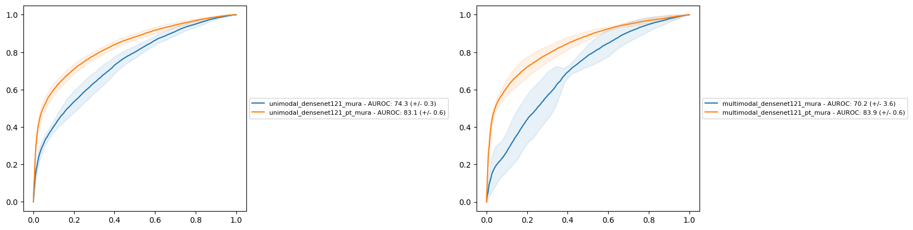

# Introduction

This example is an extension of the [MURA example](https://github.com/heds-trm/mindful_core/tree/main/examples/mura) of `mindful_core`, where we classified radiographs of the upper extremities as being abnormal or normal using the publicly available [MURA](https://stanfordmlgroup.github.io/competitions/mura/) dataset.

The difference here is that we used a _multimodal_ model based on the "Sieve" architecture showcased in our paper on breast cancer lesion in dynamic MRI[^1].

## Preparation

### MURA dataset preparation
Follow the instructions in the `mindful_core` [MURA example](https://github.com/heds-trm/mindful_core/blob/main/examples/mura/MURA_README.md#mura-dataset-download-and-unzip) to download the MURA dataset and prepare the [folds for cross-validation](https://github.com/heds-trm/mindful_core/blob/main/examples/mura/MURA_README.md#fold-config-files), if necessary. 

The data is installed in a folder that we will refer to as `<mura_data>`. Create a folder for the experiments, referred to as `<exp_data>`. You can use the same as in the `mindful_core` MURA example as config files will not be overwritten. Hence we will assume that `<exp_data>/folds` contains the folds config files.

### Experiment config files
Similarly to the [section on config preparation](https://github.com/heds-trm/mindful_core/blob/main/examples/mura/MURA_README.md#experiment-config-files) of the `mindful_core` example, we will prepare the necessary files to run experiments:

```
python ./make_mura_configs.py --output_dir <exp_data>/config --folds_dir <exp_data>/folds --pipelines_dir <exp_data>/config/pipelines --models_dir <exp_data>config/models --runs_dir <exp_data>/config/runs --logs_dir <exp_data>/logs
```

Output folders are automatically created. Folder `<exp_data>/logs` will contain the future output of the experiments.

> [!NOTE]
> Additional information on the configuration files is found [here](./MURA_EXPERIMENT_CONFIGURATION.md).

### Running experiments

Experiments can be run with the following command line:

```
python -m mindful_subream.main --config <exp_data>/config/runs/multimodal_config_run.json
```

You must run it in the folder containing the folder `mindful_subream` (which contains `main.py`). Notice that you must use the `main.py` script of `mindful_subream` instead of the one in `mindful_core` if you want to access to the multimodal model.

Main config file `multimodal_config_run.json` states which experiments are set to be run if their `skip` flag is set to `no`. Currently two experiments are proposed:
- _multimodal_densenet121_mura_: 5-fold multimodal classification of positive and negative samples using a Densenet 121 model.
- _multimodal_densenet121_pt_mura_: same but using a pretrained Densenet model. 

Both experiments are mostly identical, with the only difference that we specify the use of pretraining in the second one. 

Produced training files (tensorboard files, `.ckpt` checkpoints, etc.) will be placed in `<exp_data>/logs/<experiment_name>`. 

### Multimodality

Compared to the example in `mindful_core` the current model fuse information encoded from two sources:
- the X-Ray image, with features produced by a Densenet121 architecture.
- Categorical information, listed in file `<exp_data/folds/mura_body_parts.csv>`.

Here to showcase the multimodality fusion of mindful, we used the imaged body part as the categorical information: elbow, finger, forearm, hand, humerus, shoulder and wrist. 

[Example of categorical information](../doc/mura_body_parts_sample.csv)

For instance:
```csv
ScanID,BodyPart
XR_ELBOW_patient00011_study1_negative_image1,XR_ELBOW
```
indicates that image with unique id `XR_ELBOW_patient00011_study1_negative_image1` is an elbow. The unique ID **must** match the same ID in the dataset folds config files.

While there are high chances that this body part information will not help in the targeted classification task, this example is just to illustrate the capabilities of `mindful`.

### Inspecting the results

The log folder will also contain information on the testing phase of the experiments in various files. Among them, `formatted_summary.csv` provides an overview of the performances of the experiments over the various folds. 

If you would like to produce ROC curves for your experiments, you can use the script [draw_roc_comparisons.py](https://github.com/heds-trm/mindful_core/blob/main/scripts/outcomes/draw_roc_comparisons.py) of `mindful_core`:

```
python -m mindful_core.scripts.outcomes.draw_roc_comparisons <exp_path>/config/runs/multimodal_config_run.json 
```

This script must be called from the folder containing the `mindful_core`directory. Curves of chosen experiments will be output in a same ROC figure located in the config folder and named after the config filename. Notice that you can pass multiple config files in the command line to include several experiments at once. For instance, if we provide the config files of the MURA examples in `mindful_core` and `mindful_subream` resulting in the following _comparison_ figure: 



The solid line represents the average over the folds, while the transparent area indicates the variation around the average.

By default this command will include all experiments in the ROC figure, regardless their `skip` value in the corresponding config file. To change that, use the `--skip-experiments` option in the command line. 

[^1]: Lokaj, B., de Gevigney, V. D., Djema, D. A., Zaghir, J., Goldman, J. P., Bjelogrlic, M., ... & Schmid, J. (2025). Multimodal deep learning fusion of ultrafast-DCE MRI and clinical information for breast lesion classification. Computers in biology and medicine, 188, 109721. 10.1016/j.compbiomed.2025.109721
